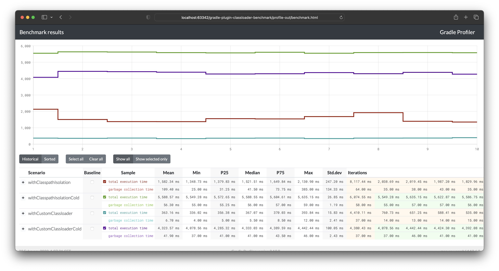

# Gradle plugin classloader benchmarks

This project contains a synthetic Gradle plugin that loads some API implementation on the flight 
and runs it via Gradle workers API.

It shows difference between two approaches:
1. Using Gradle workers API with classpath isolation. With this approach, Gradle creates a new classloader each time.
2. Using Gradle workers API without isolation. With this approach, we can manage classloaders ourselves and perform its caching

## Results

You can find results html [here](./benchmark.html).
They are obtained via [Gradle profiler](https://github.com/gradle/gradle-profiler) running the following command:
`gradle-profiler --measure-gc --scenario-file gradle-profiler.scenarios --benchmark`

**Benchmark environment:** 
JDK: Amazon Corretto 17.0.6.10.1 
CPU: Apple M1 Max